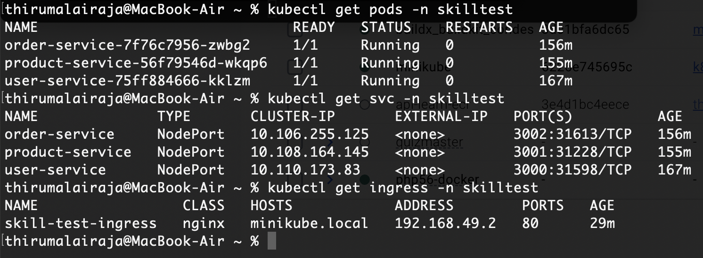
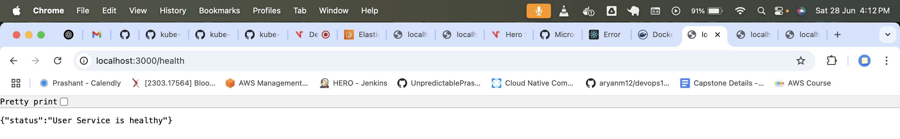
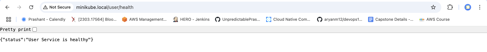
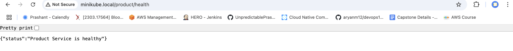
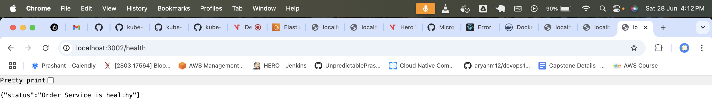

# Microservices-Task using Kubernets

## Overview
This document provides output of the minikube setup for 3 Micro service services User, Product and Orders using Kubectl deploy and service.


---

## Services and Endpoints

### Namespace

Applied the namespace.yaml to create the namespace "skilltest"

### Created docker images and pushed to Docker hub


### **Kubectl Output**

The 3 services and 3 pods are created



Used the node port to run in the MAC for the 3 services and got the below output

### **User Service**
- **Base URL:** `http://localhost:3000`
- **Ingress URL:** `http://minikube.local/user/`

- **Endpoints:**
  - **List Users:**  
    ```
    curl http://localhost:3000/users
    ```
    Or open in your browser: [http://localhost:3000/users](http://localhost:3000/users)

  - **Output - Basic**
  

  - **Output - Ingress**
  


---

### **Product Service**
- **Base URL:** `http://localhost:3001`
- **Ingress URL:** `http://minikube.local/product/`

- **Endpoints:**
  - **List Products:**  
    ```
    curl http://localhost:3001/products
    ```
    Or open in your browser: [http://localhost:3001/products](http://localhost:3001/products)

  - **Output - Basic**
  

  - **Output - Ingress**
  

---

### **Order Service**
- **Base URL:** `http://localhost:3002`
- **Ingress URL:** `http://minikube.local/order/`
- **Endpoints:**
  - **List Orders:**  
    ```
    curl http://localhost:3002/orders
    ```
    Or open in your browser: [http://localhost:3002/orders](http://localhost:3002/orders)

  - **Output - Basic**
  

  - **Output - Ingress**
  


